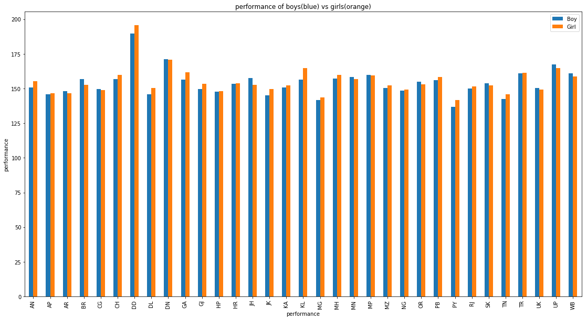

# National Achievement Survey Analysis

## Datasets

The National Achievement test was taken by 185348 students in 6,722 schools across 33 states and union territories of India. 
Data collected not only involves marks but also different aspects of students  involving family background, daily routine and poverty.
3 datasets are provided 
 1.nas pupil marks
 2.nas columns
 3.nas labels
## steps in analysis of data

### required python dependancies
import pandas as pd
import numpy as numpy
import matplotlib as mpl  
import matplotlib.cm as cm 
import matplotlib.pyplot as plt

### 1.Loading  of data and counting no of null values 
Maths %                   92661 out of 185348
Reading %                 92073
Science %                 94342
Social %                  95765
### 2.finding and deleting duplicates
duplicates=marks[marks.duplicated()] #detecting number of duplicates
duplicates.shape

(16, 64)
marks=marks.drop_duplicates() #deleting duplicates
marks.shape
(185332, 64)

### 3.handling nans
Presence of above 90000 nans in three columns can affect data analysis .if all nans are removed then analysis will be losing 90000 rows which will impact data analysis
Filling of nans using mean will be a better method.marks.fillna(marks.mean(),inplace=True)
marks.head()
### 4.handling of categorical values
arr=marks.dtypes=="object"
marks.columns[arr]

otput:Index(['State', 'Use computer', 'Subjects'], dtype='object')
marks['Use computer'] = marks['Use computer'].map({"Yes":1,"No":0})
marks['Subjects'] = marks['Subjects'].map({'L':1, 'S':2, 'O':3, 'M':4, '0':0})
marks['Use computer'].head()

output:0    0.0
1    0.0
2    0.0
3    0.0
4    0.0
Name: Use computer, dtype: float64

# Questions

## How do boys and girls perform across states?
performance of student is equal to sum of marks in mats science reading and social.
this can be done by sumation of respective columns  in marks dataset
seperation of boys and girls can be done using pivot methodmarks["performance"]=marks["Maths %"]+marks["Reading %"]+marks["Science %"]+marks["Social %"]
marks.head()

pivot=marks.pivot_table("performance",index=["State"],columns=["Gender"], aggfunc ="mean")
del pivot[0]
pivot.head()

pivot.columns=["Boy","Girl"]
pivot.head()

### Graph

By plot we can decide  Girls perform better
## Does southindian excel at math and science ?
creating a dataframe which contains maths and science marks

marks["MSc"]=marks["Maths %"]+marks["Science %"] #perecentage of marks in maths and science MSc

and plotting based on two states south and rest of india
### plot
 vs rest indians performance in maths and science")

## No

### Thankyou
