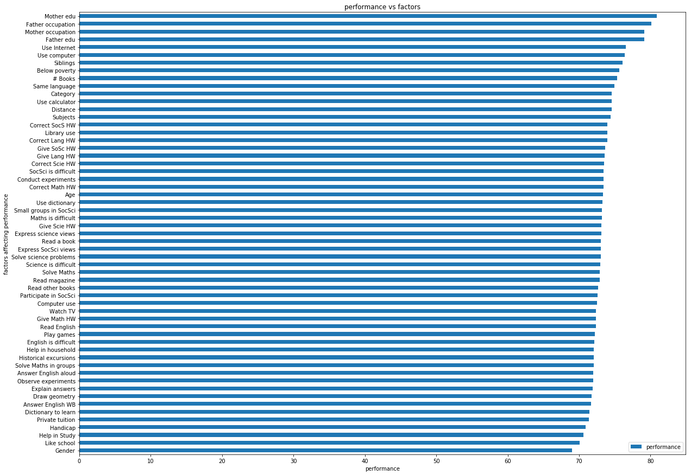

# National Achievement Survey Analysis

## Datasets

The National Achievement test was taken by 185348 students in 6,722 schools across 33 states and union territories of India. 
Data collected not only involves marks but also different aspects of students  involving family background, daily routine and poverty.
      
## steps in analysis of data

### required python dependancies
    import pandas as pd    
    import numpy as numpy           
    import matplotlib as mpl           
    import matplotlib.cm as cm          
    import matplotlib.pyplot as plt     

### 1.Loading  of data and counting no of null values 
    Maths %                   92661 out of 185348           
    Reading %                 92073           
    Science %                 94342      
    Social %                  95765        
### 2.finding and deleting duplicates
    Nas pupil data contains 16 duplicate rows these are to be deleted 
 

### 3.handling nans
    Presence of above 90000 nans in three columns can affect data analysis .if all nans are removed 
    then analysis will be losing 90000 rows which will impact data analysis                             
    Filling of nans using mean will be a better                         
Data Loading and Data transformation code and clear explanation can  be found in nas data transformation.ipynb
# Questions       
## 1.What influences students performance the most ?                                
  Students performance is affected by factors like father education,occupation,watching tv etc.By summarising data using pivot following are deduced       
  
        Top factors that influence peformance:                       
                                performance                   
            Mother edu           80.856567 
            Father occupation    80.094206         
            Mother occupation    79.119641      
            Father edu           79.096714            
            Use Internet         76.549502           
     Top factors that doesnOt influence peformance much:            
                                performance          
            Gender             68.980816            
            Like school        70.074740            
            Help in Study      70.645384         
            Handicap           70.951269          
            Private tuition    71.366002                   
Code can be found in question1.ipynb
           

## 2.How do boys and girls perform across states?                                

    Performance of student is calucated by the average of marks in subjects MATHS,SCIENCE,SOCIAL,READING after filling the nan values in these columns using mean method(fillna) .                           
     After analysing the data ,   following are deduced                                        
             1.In12 states Boys perform better than girls            
             2.In 21 states Girls  perform better than boys                    
             3.  DD   state records in best(max) performance of boys  with average 189             
             4.  DD  state records in best(ma)   performance of girls  195                
             5. KL   state accounts for maxdifference between girls and boys with  8.30    
             6. DN   state accounts for mindifference between girls   and boys with 0.39    
             7. PY     state accounts for poor performance of boys (136) and  PY   state for girls with 141       
   
    

### Graph

By plot  and analysis  we can state that  girls perform better than Boys  overall.
Code can be found in question2.ipynb
## 3.Does southindian excel at math and science ?

TO know whether South indians excel in Math and Science,States are divied into two        
    1. South india  ["AP","TN","KL","KA","PY"]
    2. Rest Of india ['AN',  'AR', 'BR', 'CG', 'CH', 'DD', 'DL', 'DN', 'GA','GJ', 'HP', 'HR',
       'JH', 'JK',  'MG', 'MH', 'MN', 'MP', 'MZ', 'NG', 'OR', 'PB',  'RJ', 'SK',  'TR', 'UK','UP', 'WB']
 
   Average of performance in Subjects Math and Science are calucated  and are compared with each other 
   
      Top performance of students in maths and science  [ 86.84753456] in the state ['DD']    
      Poor performance of students in maths and science  [ 62.13869848] in the state ['PY']       
   Average of performance in Subjects Math and Science are calucated  and are compared with each other    
   
                Average of southindians is  [ 64.79045937] 
               Average of restofindians is  [ 69.69098351] 

 

      
### plot
 vs rest indians performance in maths and science")           

After analysis ,it is concluded that Rest of India perform better than South india in Maths and Science
Code can be found in question3.ipynb

